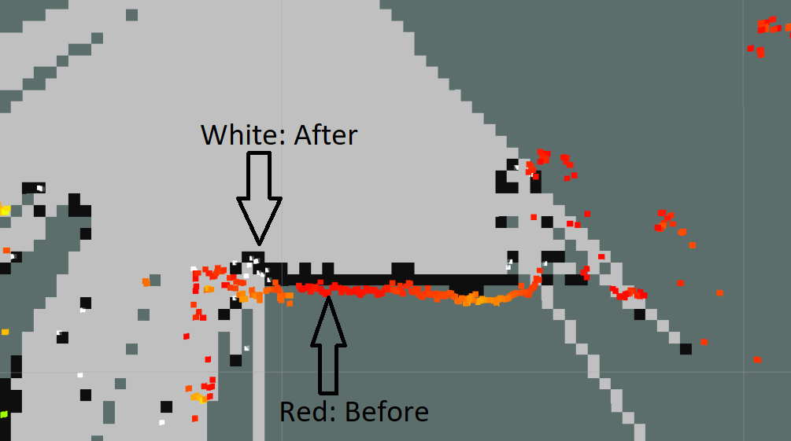

# Laser Static Map Subtraction Filter

Subtract a static map (`OccupancyGridMap`) from a laser scan or point cloud.
This package is intended to be used for example in conjunction [obstacle_detector](https://github.com/tysik/obstacle_detector).

If you only got a `sensor_msgs::LaserScan`, you can use the scans merger node of `obstacle_detector` to get a `sensor_msgs::PointCloud` msg.



## Installation

```bash
vcs import --recursive --input laser_static_map_filter/laser_static_map_filter.repos
catkin build
```
